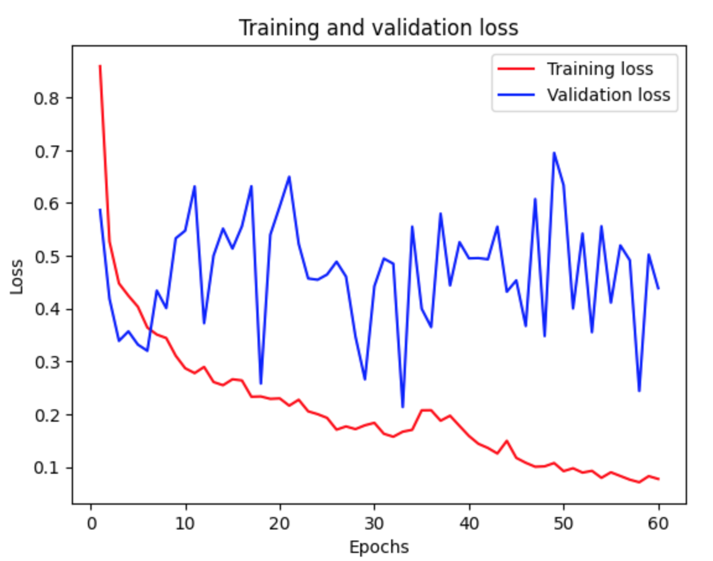
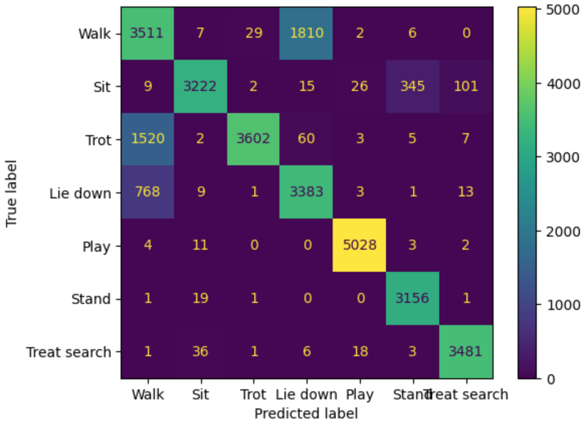

## Analyzing dog IMU from Kaggle

**Project description:** I used a publicly available dataset from Kaggle to get a better feel for activity classification based on IMU data.

### 1. Preprocessing the dataset

The original dataset consisted of IMU data from 45 dogs of different breeds. 
The authors of the original study chose to perform classification using feature engineering followed by a linear classifier. I wanted to see if I could acheive comparable results using an RNN without additional feature engineering.  

The original dataset was a little wonky to interpret. The experimenters assigned the dogs one of 7 tasks and then manually annotated behaviors that the dog actually performed during the assigned task. They did not make all of these annotated behaviors actual classes for their activity classification.

<p align="center">

 <em>Sample of the raw data</em>
</p>

<p align="center">

 <em>Raw x-axis accelerometer values for an individual dog</em>
</p>

To simplify matters, I decided that all samples where one of the annotated behaviors was the same as the assigned task qualified as a legitimate instance of that activity.  

<p align="center">

 <em>Instance where the assigned task was "walk" and the experimenters noted that one of three observed behaviors was walking</em>
</p>

#### 2. Class distribution and data split
The distribution between activity classes was relatively uniform. Therefore, I didn't take any additional measures to change the class distribution of the dataset.  

<p align="center">
 </br>

</p>

A typical train/validation/test breakdown is usually 80%/10%/10%, meaning that there would be roughly 37 dogs in the training set, 4 in the validation set, and 4 in the test set.

Due to the low number of samples, I chose to adjust the data split slightly to include 33 dogs in the training set, 6 in the validation set, and 6 in the test set.

### 3. Model selection and parameters
I chose an LSTM because these models are capable of learning long term dependencies in sequenced data. I chose a bi-directional LSTM specifically because BLSTMs are able to capture sequential dependencies in both directions of the sequence, and I thought this would be beneficial for analysis of a kinematic dataset.  

However, BLSTMs are very computationally expensive. For completeness, it would likely be worthwhile to compare the performance to that of a regular LSTM to ensure that the additional computational complexity actually results in an improvement in model performance.

### 4. Result
Overall, the final bi-directional LSTM achieved a X% accuracy on the test set.  

The final model was trained in 40 epochs. Further epochs showed an emerging gap between training and validation sets, indicating overfitting.  

<p align="center">

</p>

However, given the relatively few number of samples in the validation set, the loss curve was still rather noisy.    

<p align="center">

</p>

#### Confusion matrix

<p align="center">


</p>


### Further experiments
This was intended to be a quick-and-dirty attempt at activity classification using an RNN. There is [literature](https://www.researchgate.net/publication/337629344_A_Bidirectional_LSTM_for_Estimating_Dynamic_Human_Velocities_from_a_Single_IMU) to suggest that high level feature extraction using a CNN before applying a bi-direction LSTM is beneficial to model performance in the case of a single IMU. Additionally, it would be interesting to test different LSTM variants to see which variant yielded the best performance.
 
<!---
```javascript
if (isAwesome){
  return true
}
```

### 2. Assess assumptions on which statistical inference will be based

```javascript
if (isAwesome){
  return true
}
```

### 3. Support the selection of appropriate statistical tools and techniques


### 4. Provide a basis for further data collection through surveys or experiments

Sed ut perspiciatis unde omnis iste natus error sit voluptatem accusantium doloremque laudantium, totam rem aperiam, eaque ipsa quae ab illo inventore veritatis et quasi architecto beatae vitae dicta sunt explicabo. 

For more details see [GitHub Flavored Markdown](https://guides.github.com/features/mastering-markdown/). --->
