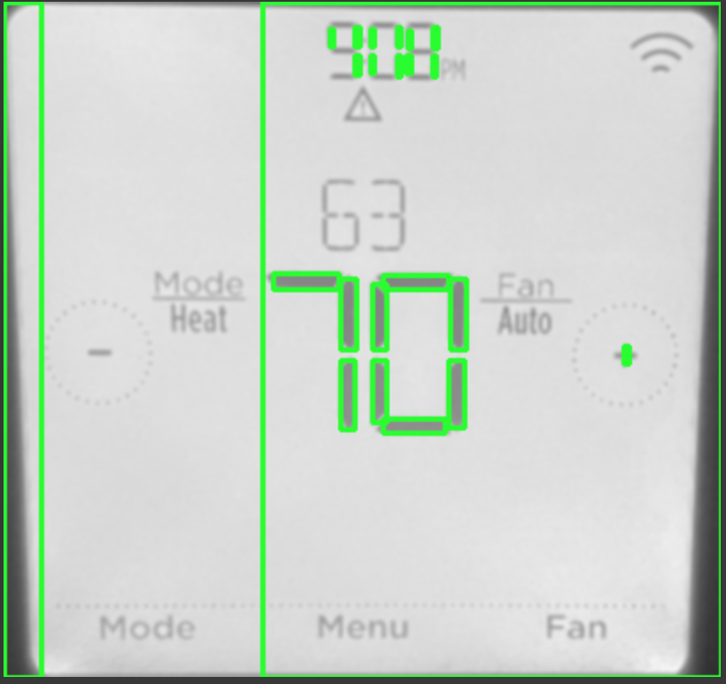

## Portfolio

---

### Machine Learning

[Classifying dog activity based on IMU data](/dog_imu_analysis)

Activity classification using an LSTM on publically available dog IMU data. 
<!-- [Jupyter Notebook](https://7969a929c4f90c0e-dot-us-west1.notebooks.googleusercontent.com/lab?authuser=0&username=Kristine_Chen) -->

---
[Comparative analysis of different approaches in human activity recognition (HAR)](/kaggle_smartphone_human_activity_analysis)

<!--
### No one: 
### Me:

- [Why does no one do computer vision using hand-tuned features anymore?](http://example.com/)

[Project 3 Title](http://example.com/)

---
### Embedded Software

- [Project 1 Title](http://example.com/)
- [Project 2 Title](http://example.com/)
- [Project 3 Title](http://example.com/)
- [Project 4 Title](http://example.com/)
- [Project 5 Title](http://example.com/)
---
-->

---

Page template forked from <a href="https://github.com/evanca/quick-portfolio">evanca</a>

<!-- Remove above link if you don't want to attibute -->
