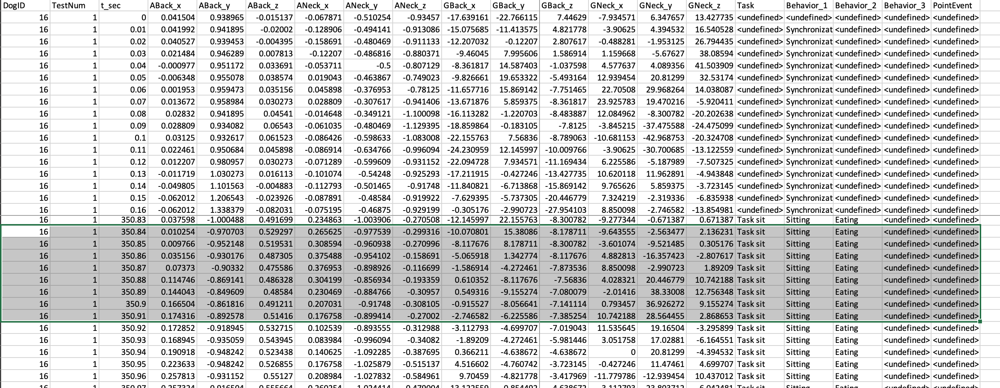
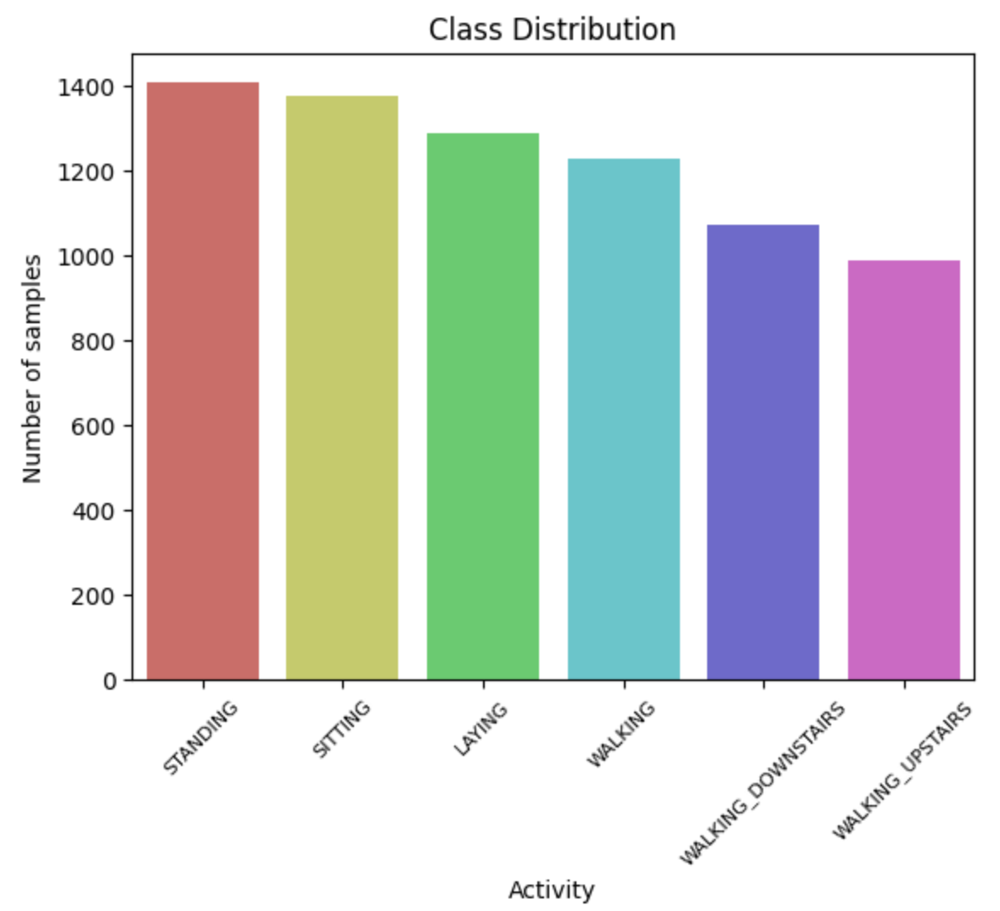
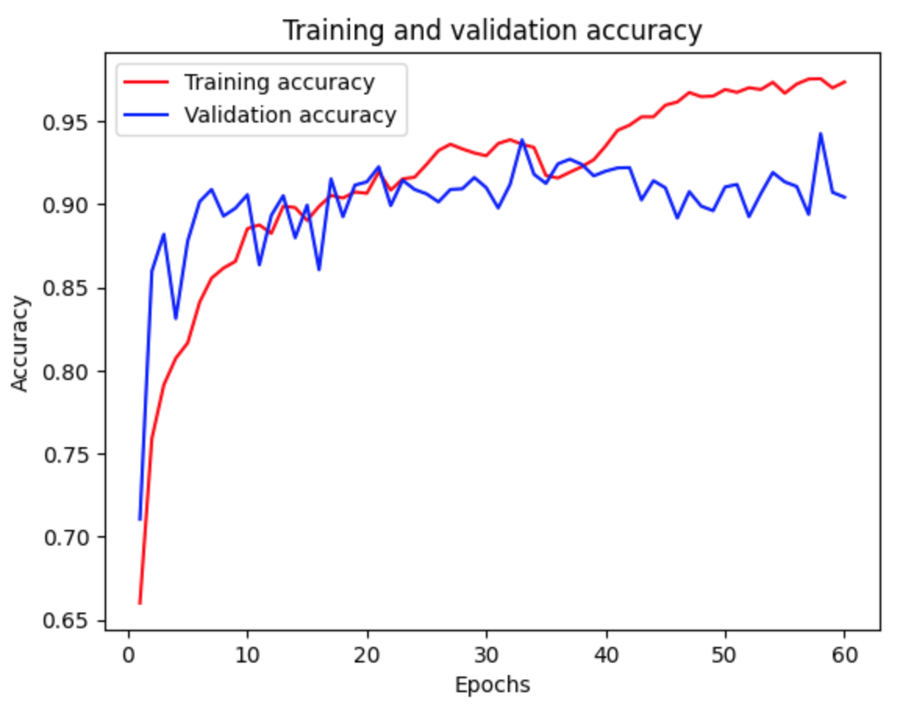
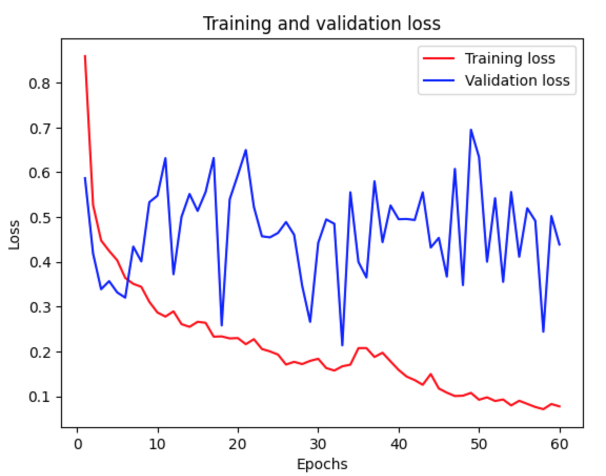
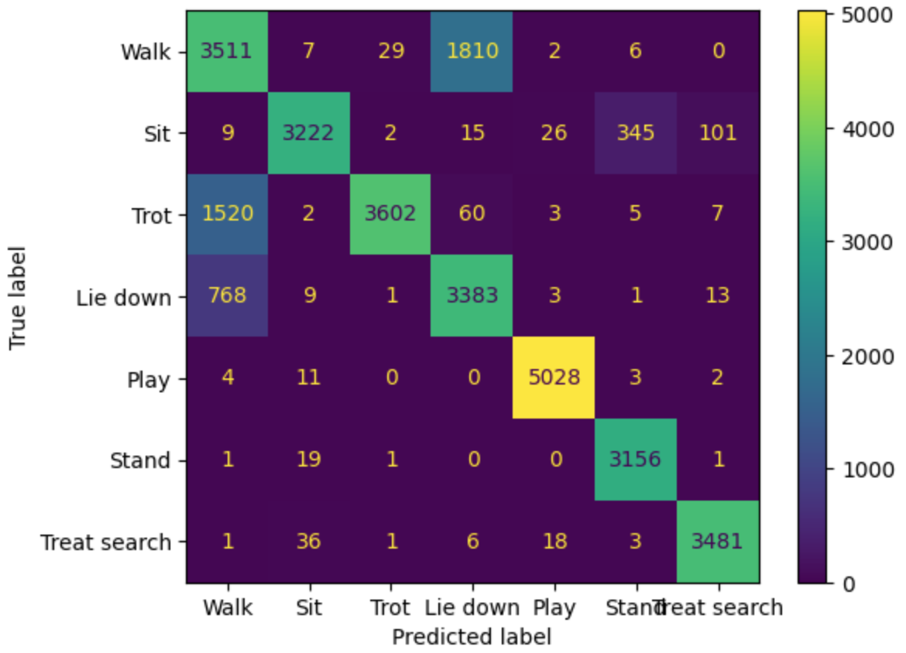
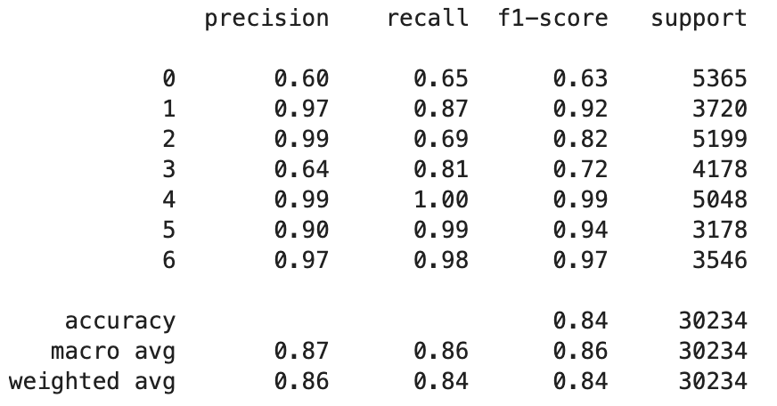

## Analyzing human activity data collected from a smartphone (via Kaggle)

**Project description:** I used a publicly available dataset from Kaggle to get a better feel for activity classification based on IMU data.

### 1. The dataset

The original dataset consisted of smartphone data from a Samsung Galaxy S II worn about the waist by 30 volunteers between the ages of 19 and 48. Each individual performed six activities: walking, walking upstairs, walking downstairs, sttting, standing, and laying. 

Triaxial accelerometer and gyroscope data was captured at a constant rate of 50Hz. The experimenters video-recorded the trials and manually labeled the activities. These sensor signals were then preprocessed through the application of noise filters and then resampled in fixed-width sliding windows of 2.56 seconds with 50% overlap (128 readings/window). The entire dataset contains samples from 10299 time steps (after resampling).

In addition, acceleration was separated into gravitational and body motion components using a Butterworth low-pass filter. A cutoff frequency of 0.3 Hz was used as the threshold for the gravitational contribution, which was assumed to be low frequency compared to body motion contributions.

The experimenters also included other features from the time and frequency domains for a total of 561 features.
 
<p align="center">

 <em>Sample of the raw data</em>
</p>


#### 2. Class distribution and data split
The data was already pre-divided into separate train and test CSVs with approximately 70% of the data in the training set and 30% of the data in the test set.

The data are slightly biased toward stationary activities, but overall, there is not a vast discrepancy between the number of samples in the 6 classes.

<p align="center">
 </br>
</p>

### 3. Data exploration
#### Summary statistics
TODO: insert image
#### Dimensionality reduction

##### PCA
##### LDA
#### Non-linear data visualization
##### t-SNE
#### Feature selection
The ultimate goal of feature selection is to come up with a subset of the original feature set in order to reduce model complexity without compromising accuracy. Smaller feature sets tend to be computationally less expensive and easier for humans to comprehend. </br>
There are many ways to conduct feature selection. I chose to examine univariate feature selection for classification, reduced feature elimination with cross validation (RFECV) and a Random Forest Classifier.

##### Univariate feature selection
I first normalized the feature set to have values between [0,1] because Pearson's Correlation is only valid for positive values. After selecting only features whose p-values were less than 0.05, the number of features was reduced from 561 to 528. 
<p align="center">
 </br>
</p>

##### Random Forest Classifier
Random Forest Classifers are often used for .........
in general good predictive performance, low overfitting, and easy interpretability

In other words, it is easy to compute how much each variable is contributing to the decision.

I ran a Random Forest Classifier on only the training data to avoid overfitting. I experimented with number of trees, trying values of 100, 500, and 1000. The RFC selected different number of features depending on the number of decision trees. 
# TODO: determine if lots of my features are highly correlated b/c highly correlated features will be weighted less
# TODO: insert tabel

Out of the 251 features, X features are linearly independent (based on the rank of X_train). </br>
The Random Forest Classifier selected 126 features out of 251. 

I later used this reduced feature set to train some models to see if the reduced feature set would drastically affect accuracy. 

# TODO: random forest classifier plot; gini impurity

### 4. Model selection and parameters
Based on initial data exploration, it seemed like a linear model had the potential to perform well on this dataset.
#### Linear SVM
SVMs aim to
##### Linear SVM with reduced feature set
I used the reduced feature set selected by the Random Forest Classifier above to train a linear SVM to see if 
##### Non-linear kernels - just for kicks
#### Basic Neural Network
##### Hyperparameters
##### Tuning with Optuna

### 5. Result
Overall, the final bi-directional LSTM achieved a 84% accuracy on the test set.  

The final model was trained in 40 epochs. Further epochs showed an emerging gap between training and validation sets, indicating overfitting.  

<p align="center">

</p>

However, given the relatively few number of samples in the validation set, the loss curve was still rather noisy.    

<p align="center">

</p>

#### Confusion matrix

<p align="center">


</p>


### Further experiments
This was intended to be a quick-and-dirty attempt at activity classification using an RNN. There is [literature](https://www.researchgate.net/publication/337629344_A_Bidirectional_LSTM_for_Estimating_Dynamic_Human_Velocities_from_a_Single_IMU) to suggest that high level feature extraction using a CNN before applying a bi-direction LSTM is beneficial to model performance in the case of a single IMU. Additionally, it would be interesting to test different LSTM variants to see which variant yielded the best performance.
 
<!---
```javascript
if (isAwesome){
  return true
}
```

### 2. Assess assumptions on which statistical inference will be based

```javascript
if (isAwesome){
  return true
}
```

### 3. Support the selection of appropriate statistical tools and techniques


### 4. Provide a basis for further data collection through surveys or experiments

Sed ut perspiciatis unde omnis iste natus error sit voluptatem accusantium doloremque laudantium, totam rem aperiam, eaque ipsa quae ab illo inventore veritatis et quasi architecto beatae vitae dicta sunt explicabo. 

For more details see [GitHub Flavored Markdown](https://guides.github.com/features/mastering-markdown/). --->
