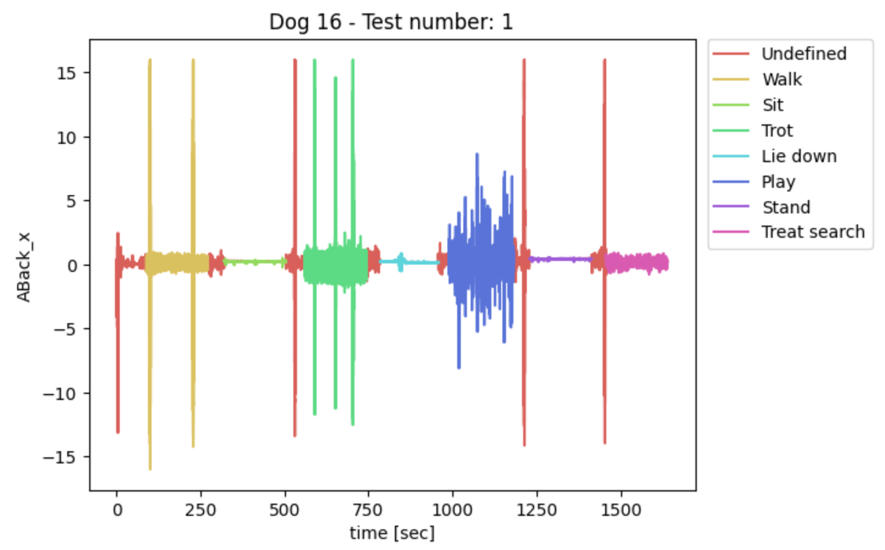

## Analyzing human activity data collected from a smartphone (via Kaggle)

**Project description:** I used a publicly available dataset from Kaggle to get a better feel for activity classification based on IMU data.

### 1. The dataset

The original dataset consisted of . 
The authors of the original study chose to . 
I wanted to .  


<p align="center">

 <em>Sample of the raw data</em>
</p>

<p align="center">

 <em>Raw x-axis accelerometer values for an individual dog</em>
</p>


#### 2. Class distribution and data split
The data was already pre-divided into separate train and test CSVs.  

<p align="center">
 </br>
</p>

A typical train/validation/test breakdown is usually 80%/10%/10%, meaning that there would be roughly 37 dogs in the training set, 4 in the validation set, and 4 in the test set.

Due to the low number of samples, I chose to adjust the data split slightly to include 33 dogs in the training set, 6 in the validation set, and 6 in the test set.

### 3. Data exploration
#### Summary statistics
TODO: insert image
#### Dimensionality reduction

##### PCA
##### LDA
#### Non-linear data visualization
##### t-SNE
#### Feature selection via a Random Forest Classifier

### 4. Model selection and parameters
Based on initial data exploration, it seemed like a linear model had the potential to perform well on this dataset.
#### Linear SVM
##### Non-linear kernels - just for kicks
#### Basic Neural Network
##### Hyperparameters
##### Tuning with Optuna

### 5. Result
Overall, the final bi-directional LSTM achieved a 84% accuracy on the test set.  

The final model was trained in 40 epochs. Further epochs showed an emerging gap between training and validation sets, indicating overfitting.  

<p align="center">

</p>

However, given the relatively few number of samples in the validation set, the loss curve was still rather noisy.    

<p align="center">

</p>

#### Confusion matrix

<p align="center">


</p>


### Further experiments
This was intended to be a quick-and-dirty attempt at activity classification using an RNN. There is [literature](https://www.researchgate.net/publication/337629344_A_Bidirectional_LSTM_for_Estimating_Dynamic_Human_Velocities_from_a_Single_IMU) to suggest that high level feature extraction using a CNN before applying a bi-direction LSTM is beneficial to model performance in the case of a single IMU. Additionally, it would be interesting to test different LSTM variants to see which variant yielded the best performance.
 
<!---
```javascript
if (isAwesome){
  return true
}
```

### 2. Assess assumptions on which statistical inference will be based

```javascript
if (isAwesome){
  return true
}
```

### 3. Support the selection of appropriate statistical tools and techniques


### 4. Provide a basis for further data collection through surveys or experiments

Sed ut perspiciatis unde omnis iste natus error sit voluptatem accusantium doloremque laudantium, totam rem aperiam, eaque ipsa quae ab illo inventore veritatis et quasi architecto beatae vitae dicta sunt explicabo. 

For more details see [GitHub Flavored Markdown](https://guides.github.com/features/mastering-markdown/). --->
