# Analyzing human activity data collected from a smartphone (via Kaggle)

**Project description:** I used a publicly available dataset from Kaggle to get a better feel for activity classification based on IMU data.

# 1. The dataset

The original dataset consisted of smartphone data from a Samsung Galaxy S II worn about the waist by 30 volunteers between the ages of 19 and 48. Each individual performed six activities: walking, walking upstairs, walking downstairs, sttting, standing, and laying. 

Triaxial accelerometer and gyroscope data was captured at a constant rate of 50Hz. The experimenters video-recorded the trials and manually labeled the activities. These sensor signals were then preprocessed through the application of noise filters and then resampled in fixed-width sliding windows of 2.56 seconds with 50% overlap (128 readings/window). The entire dataset contains samples from 10299 time steps (after resampling).

In addition, acceleration was separated into gravitational and body motion components using a Butterworth low-pass filter. A cutoff frequency of 0.3 Hz was used as the threshold for the gravitational contribution, which was assumed to be low frequency compared to body motion contributions.

The experimenters also included other features from the time and frequency domains for a total of 561 features.

# 2. Class distribution and data split
The data was already pre-divided into separate train and test CSVs with approximately 70% of the data in the training set and 30% of the data in the test set.

The data are slightly biased toward stationary activities, but overall, there is not a vast discrepancy between the number of samples in the 6 classes.

<p align="center">
 </br>
 <em>Bar plot of class counts</em>
</p>

<p align="center">
 </br>
 <em>Tabulated class counts</em>
</p>

# 3. Data exploration
## Dimensionality reduction
In order to better understand the data, I conducted dimensionality reduction using both PCA and LDA on the entire dataset.
### PCA
PCA seeks to identify the principal components that maximize the overall variance of the data.

The first principal component captured 50.6% of the variance in the data while the second principal component captured roughly 6.2%. The third and fourth components captured 2.7% and 2.4% respectively. 

<p align="center">
 </br>
 <em>Scree plot showing the variance captured by the top 4 principal components</em>
</p>

<p align="center">
 </br>
 <em>PCA plot for all classes</em>
</p>

For this particular dataset, the top two PCs did not correspond to directions of linear separability. However, in interpreting the loading matrices, we can identify the features that account for most of the variability in the dataset.

10 features that dominate PC 1: </br>
- fBodyAcc-sma() </br>
- fBodyAccJerk-sma() </br>
- fBodyGyro-sma() </br>
- tBodyAccJerk-sma() </br>
- tBodyAccJerkMag-sma() </br>
- tBodyAccJerkMag-mean() </br>
- fBodyBodyAccJerkMag-sma() </br>
- fBodyBodyAccJerkMag-mean() </br>
- tBodyAccJerkMag-mad() </br>
- tBodyAccJerkMag-std() </br>

10 features that dominate PC 2: </br>
- fBodyAcc-meanFreq()-Z </br>
- tBodyGyroMag-arCoeff()1 </br>
- fBodyAccMag-meanFreq() </br>
- tGravityAcc-arCoeff()-Z,1 </br>
- tBodyAccMag-arCoeff()1 </br>
- tGravityAccMag-arCoeff()1 </br>
- tGravityAcc-arCoeff()-Z,3 </br>
- tGravityAcc-arCoeff()-Y,3 </br>
- fBodyAcc-meanFreq()-Y </br>
- fBodyBodyGyroMag-meanFreq() </br>

### LDA
Unlike PCA, LDA or Linear Discriminant Analysis, is intended to maximize interclass differences.
When looking at only the top two discriminant components, there is decent separation between the static classes (LAYING, SITTING, STANDING) and the non-static or walking classes (WALKING, WALKING_UPSTAIRS, WALKING_DOWNSTAIRS).

<p align="center">
 </br>
 <em>LDA on all classes</em>
</p>

When we analyze the dataset in terms of only the walking classes and the static classes, we get even better linear separability.

<p align="center">
 </br>
 <em>LDA on only the walking classes: WALKING, WALKING_UPSTAIRS, WALKING_DOWNSTAIRS</em>
</p>

<p align="center">
 </br>
 <em>LDA on only the static classes: LAYING, SITTING, STANDING</em>
</p>

In the static class analysis graphic above, the STANDING and SITTING classes continue to have quite a bit of overlap. I attempted to see if I could get better separability by conducting LDA on only those two classes.

<p align="center">
 </br>
 <em>LDA on only the SITTING and STANDING classes</em>
</p>

The separation between SITTING and STANDING still does not have the same amount of margin between them as the other classes, but based on the linear separability of most of the classes using LDA, I determined that this dataset might be a good candidate for a linear classification method.

## Non-linear data visualization
### t-SNE
t-distributed stochastic neighbor embedding is a method for visualizing high-dimensional data in lower dimensional space (2-3D). It is a non-linear method of dimensionality reduction that preserves small pairwise distances or local similarities. A similarity measure is calculated in a high dimensional space and a low dimensional space and then attempts to optimize the disparate similarity measures with a cost function.

Because this dataset has six classes, I thought it would be interesting to use t-SNE to visualize the data.

<p align="center">
 </br>
 <em>t-SNE plot for all classes</em>
</p>

## Feature selection
The ultimate goal of feature selection is to come up with a subset of the original feature set in order to reduce model complexity without compromising accuracy. Smaller feature sets tend to be computationally less expensive and easier for humans to comprehend. </br>
There are many ways to conduct feature selection. I chose to examine univariate feature selection for classification, reduced feature elimination with cross validation (RFECV) and a Random Forest Classifier.

### Univariate feature selection
I first normalized the feature set to have values between [0,1] because Pearson's Correlation is only valid for positive values. After selecting only features whose p-values were less than 0.05, the number of features was reduced from 561 to 528. 
<p align="center">
 </br>
 <em>Truncated dataframe of p-values and Chi-squared values associated with all various features</em>
</p>

### Random Forest Classifier
Random Forest Classifers are often used for feature selection due to their generally good predictive performance, low overfitting, and easy interpretability. It is possible to compute how much each variable contributes to the decision.

Because RFs may wind up essentially 'discarding' one feature if two features are highly correlated without degrading model performance, I first attempted to remove highly correlated features of the dataset. This was made slightly more complicated by the sheer number of features and the fact the experimenters had deliberately included various transforms of the raw data in the feature set.

Due to these complications, I settled for calculating the rank of the training matrix. 541 out of the 561 features were linearly independent. With this knowledge, it seemed reasonable to proceed with a RFC without first removing a bunch of features from the original dataset, particularly because RFs do not suffer from multicollinearity.

I ran a Random Forest Classifier on only the training data to avoid overfitting. I experimented with the number of trees used by the classifier, trying values of 100, 500, and 1000. The RFC selected different number of features depending on the number of decision trees. 

<p align="center">
 </br>
 <em>Slightly varying feature sets depending on the number of trees generated by the classifier</em>
</p>

### TODO: RFECV

# 4. Model selection and parameters
Based on initial data exploration, it seemed like a linear model had the potential to perform well on this dataset.
## Linear SVM
SVMs aim to find the optimal hyperplane that maximizes the margin between support vectors (data points closer to the potential hyperplane) and a chosen hyperplane.

I used Optuna to explore a variety of SVM kernels (rbf, poly, sigmoid, linear) as well as different values of the hyperparameter C, which dictates the SVM's sensitivity toward misclassification. With large values of C, the optimization chooses a smaller-margin hyperplane only if the chosen hyperplane is able to classify examples correctly. A small value of C will optimize for a hyperplane with a larger margin, even if the chosen hyperplane misclassifies more examples. 

The best accuracy I was able to achieve was 96% with a linear kernel and a C value of ~0.0623.

<p align="center">
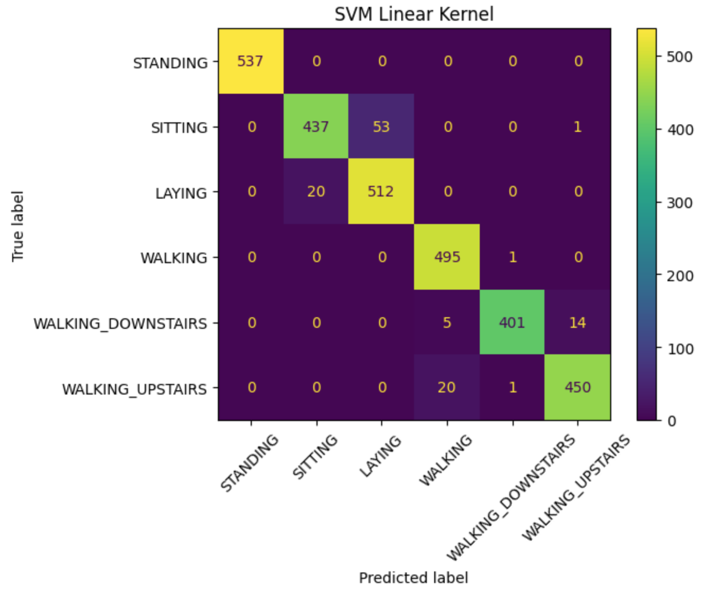 </br>
 <em>Confusion matrix for optimized linear SVM kernel</em>
</p>

The confusion matrix highlights the fact that most misclassifications either occur between certain static classes or walking classes; there are no instances in which walking classes have been misclassified as static classes or vice versa.

### Feature importance for a linear SVM
The default classifier for multiclass classification using sklearn's SVM is is one vs. one (as opposed to one vs. all). Because there are 6 classes, 15 hyperplanes are generated - each separating two classes. The 'coef_' attribute of SVC yields a 15x562 matrix of weights because there are 15 hyperplanes and 562 features. The direction provides the predicted class. If the dot product of a point with the vector is positive, it belongs to the positive class, if it is negative it belongs to the negative class.

The magnitude of the coefficients relative to the other ones gives an indication of how important the feature was for the separation. For these plots, the blue features are positively correlated with the class listed first in the title with larger bars indicating increasing importance, whereas the red features are positively correlated with the class listed second in the title (larger bars also indicated increasing importance).

<p float="middle">
  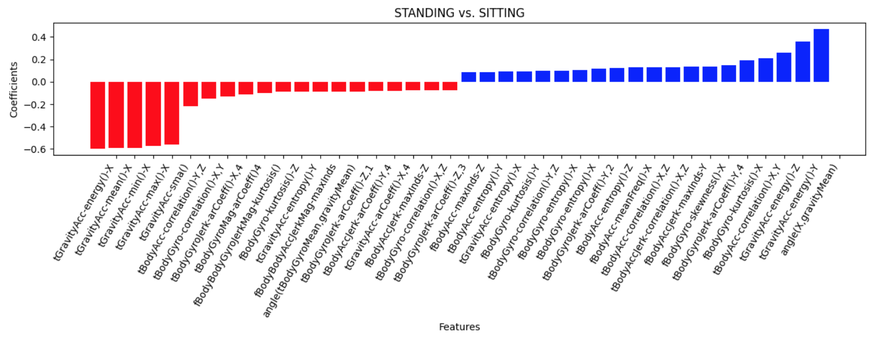
  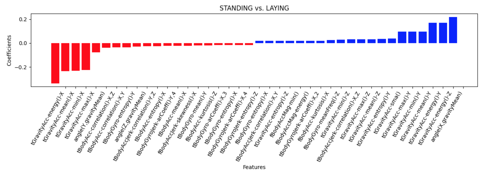 
  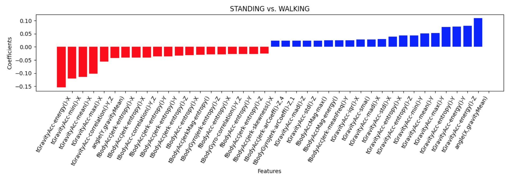
  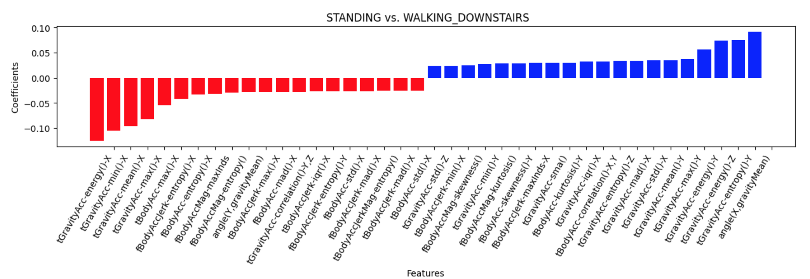 
  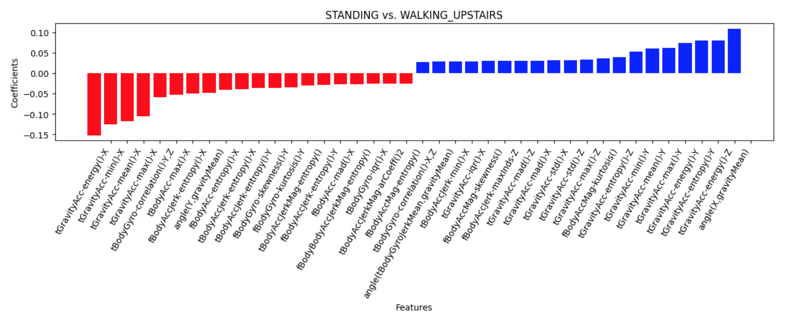
  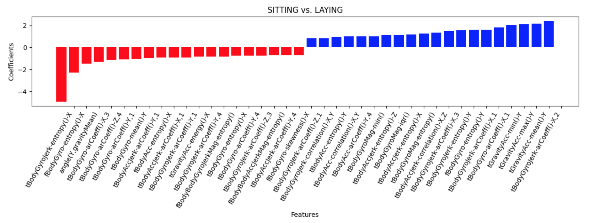
  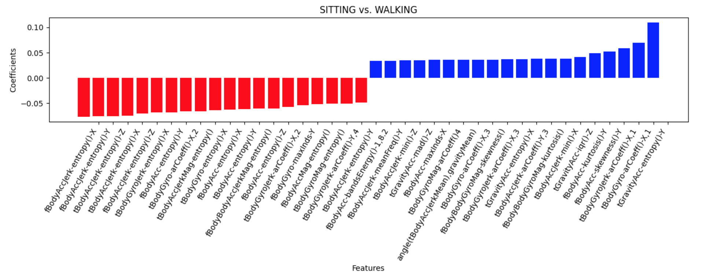
  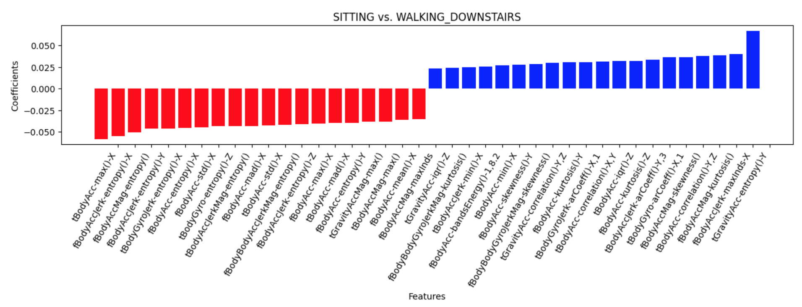 
  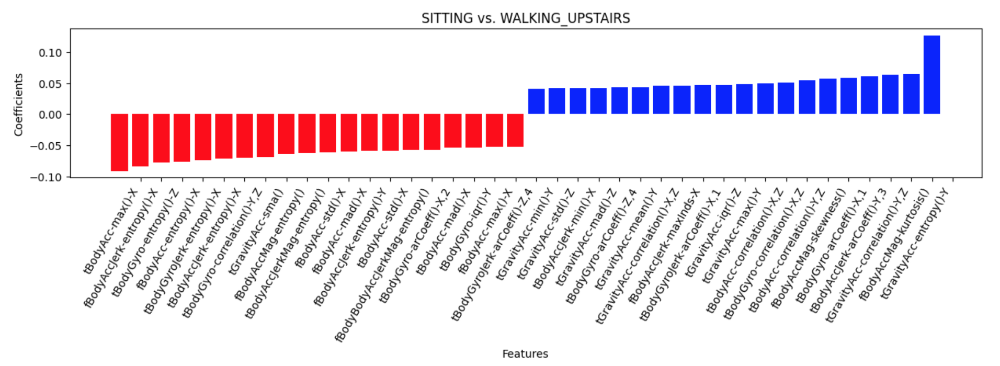
  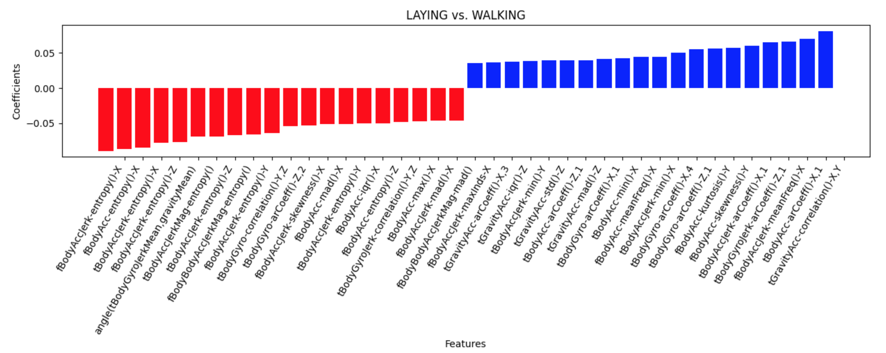 
  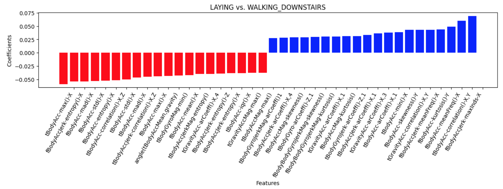
  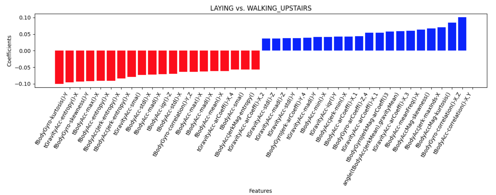 
  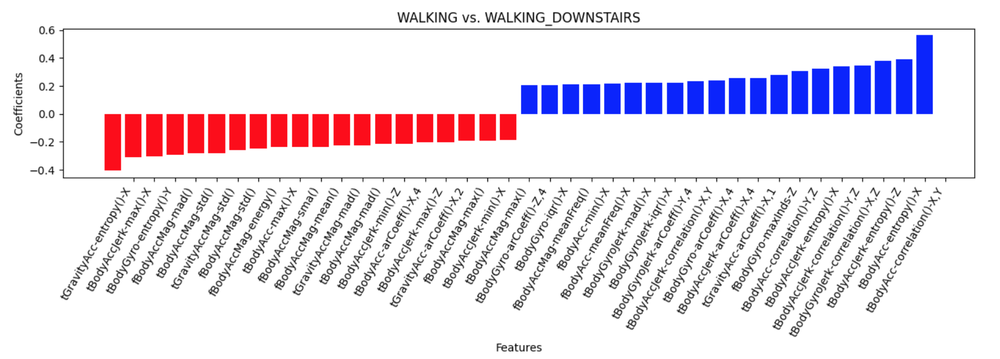
  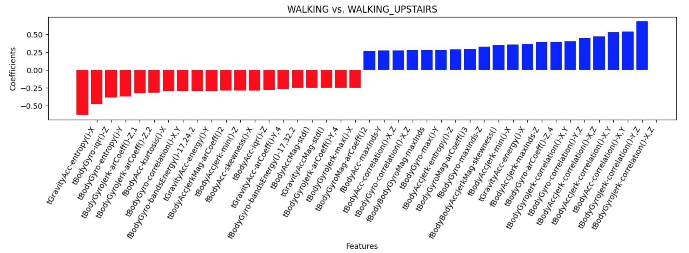 
  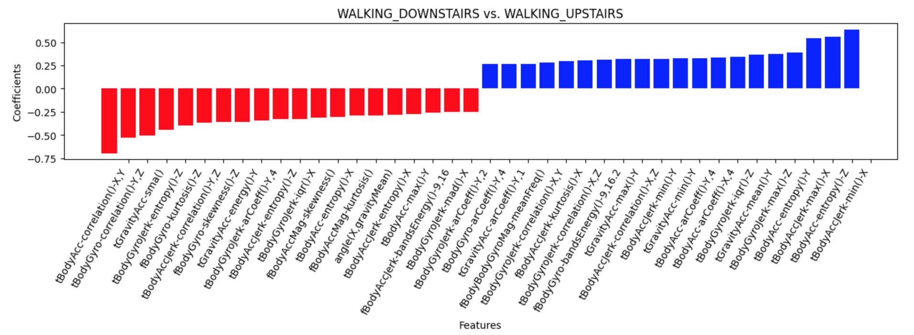 
</p>

## Linear SVM with reduced feature set
I also used the reduced feature sets generated by the three feature selection techniques I chose to train a linear SVM to see how results would differ from that of a full feature set.
1. A reduced feature set of 528 features generated by univariate feature selection
2. A reduced feature set of 549 features generated by the RFECV
3. A reduced feature set of features generated by RFC


## Basic Neural Network


# 5. Result
Overall, ............. 


<p align="center">

</p>

However, given the relatively few number of samples in the validation set, the loss curve was still rather noisy.    

<p align="center">

</p>

<p align="center">


</p> 
<!---
```javascript
if (isAwesome){
  return true
}
```

### 2. Assess assumptions on which statistical inference will be based

```javascript
if (isAwesome){
  return true
}
```

### 3. Support the selection of appropriate statistical tools and techniques


### 4. Provide a basis for further data collection through surveys or experiments

Sed ut perspiciatis unde omnis iste natus error sit voluptatem accusantium doloremque laudantium, totam rem aperiam, eaque ipsa quae ab illo inventore veritatis et quasi architecto beatae vitae dicta sunt explicabo. 

For more details see [GitHub Flavored Markdown](https://guides.github.com/features/mastering-markdown/). --->
